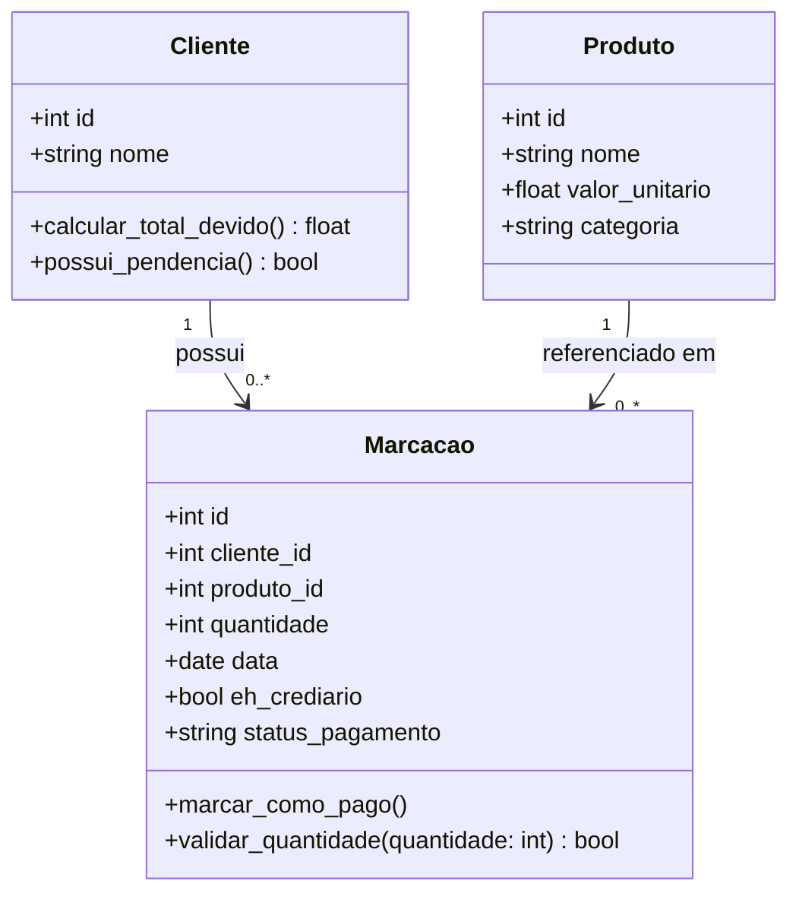

```mermaid
classDiagram
    class Cliente {
        +int id
        +string nome
        +calcular_total_devido() float
        +possui_pendencia() bool
    }
 
    class Produto {
        +int id
        +string nome
        +float valor_unitario
        +string categoria
    }
 
    class Marcacao {
        +int id
        +int cliente_id
        +int produto_id
        +int quantidade
        +date data
        +bool eh_crediario
        +string status_pagamento
        +marcar_como_pago()
        +validar_quantidade(quantidade: int) bool
    }
 
    Cliente "1" --> "0..*" Marcacao : possui
    Produto "1" --> "0..*" Marcacao : referenciado em
```
