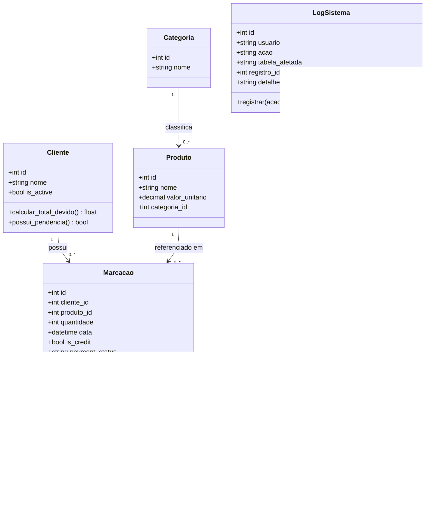

```mermaid
classDiagram
    class Cliente {
        +int id
        +string nome
        +bool is_active
        +calcular_total_devido() float
        +possui_pendencia() bool
    }

    class Categoria {
        +int id
        +string nome
    }

    class Produto {
        +int id
        +string nome
        +decimal valor_unitario
        +int categoria_id
    }

    class Marcacao {
        +int id
        +int cliente_id
        +int produto_id
        +int quantidade
        +datetime data
        +bool is_credit
        +string payment_status
        +validar_quantidade(quantidade: int) bool
    }

    class Pagamento {
        +int id
        +int marcacao_id
        +decimal valor
        +datetime data_pagamento
        +registrar_pagamento(valor: decimal) bool
    }

    class LogSistema {
        +int id
        +string usuario
        +string acao
        +string tabela_afetada
        +int registro_id
        +string detalhes
        +registrar(acao: string, tabela: string, registro_id: int) void
    }

    Cliente "1" --> "0..*" Marcacao : possui
    Produto "1" --> "0..*" Marcacao : referenciado em
    Categoria "1" --> "0..*" Produto : classifica
    Marcacao "1" --> "0..*" Pagamento : recebe
```