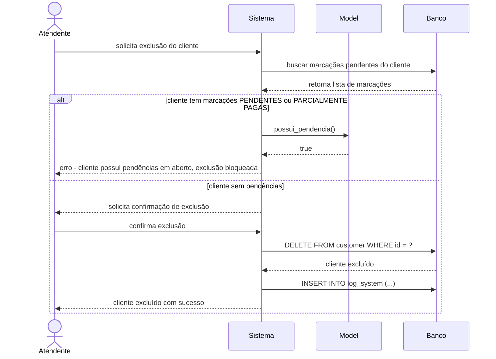

## 3. Excluir Cliente

```mermaid
sequenceDiagram
    actor Atendente
    participant Sistema
    participant Model
    participant Banco

    Atendente->>Sistema: solicita exclusão do cliente
    Sistema->>Banco: buscar marcações pendentes do cliente
    Banco-->>Sistema: retorna lista de marcações

    alt cliente tem marcações PENDENTES ou PARCIALMENTE PAGAS
        Sistema->>Model: possui_pendencia()
        Model-->>Sistema: true
        Sistema-->>Atendente: erro - cliente possui pendências em aberto, exclusão bloqueada
    else cliente sem pendências
        Sistema-->>Atendente: solicita confirmação de exclusão
        Atendente->>Sistema: confirma exclusão
        Sistema->>Banco: DELETE FROM customer WHERE id = ?
        Banco-->>Sistema: cliente excluído
        Sistema->>Banco: INSERT INTO log_system (...)
        Sistema-->>Atendente: cliente excluído com sucesso
    end
```