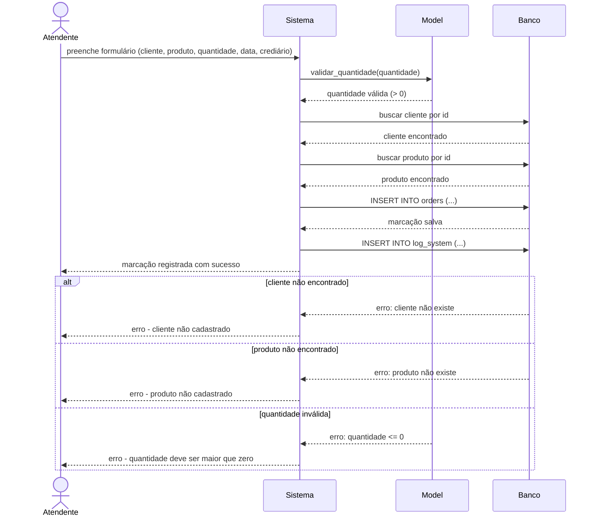

## 1. Registrar Marcação

```mermaid
sequenceDiagram
    actor Atendente
    participant Sistema
    participant Model
    participant Banco

    Atendente->>Sistema: preenche formulário (cliente, produto, quantidade, data, crediário)
    Sistema->>Model: validar_quantidade(quantidade)
    Model-->>Sistema: quantidade válida (> 0)
    Sistema->>Banco: buscar cliente por id
    Banco-->>Sistema: cliente encontrado
    Sistema->>Banco: buscar produto por id
    Banco-->>Sistema: produto encontrado
    Sistema->>Banco: INSERT INTO orders (...)
    Banco-->>Sistema: marcação salva
    Sistema->>Banco: INSERT INTO log_system (...)
    Sistema-->>Atendente: marcação registrada com sucesso

    alt cliente não encontrado
        Banco-->>Sistema: erro: cliente não existe
        Sistema-->>Atendente: erro - cliente não cadastrado
    else produto não encontrado
        Banco-->>Sistema: erro: produto não existe
        Sistema-->>Atendente: erro - produto não cadastrado
    else quantidade inválida
        Model-->>Sistema: erro: quantidade <= 0
        Sistema-->>Atendente: erro - quantidade deve ser maior que zero
    end
```
