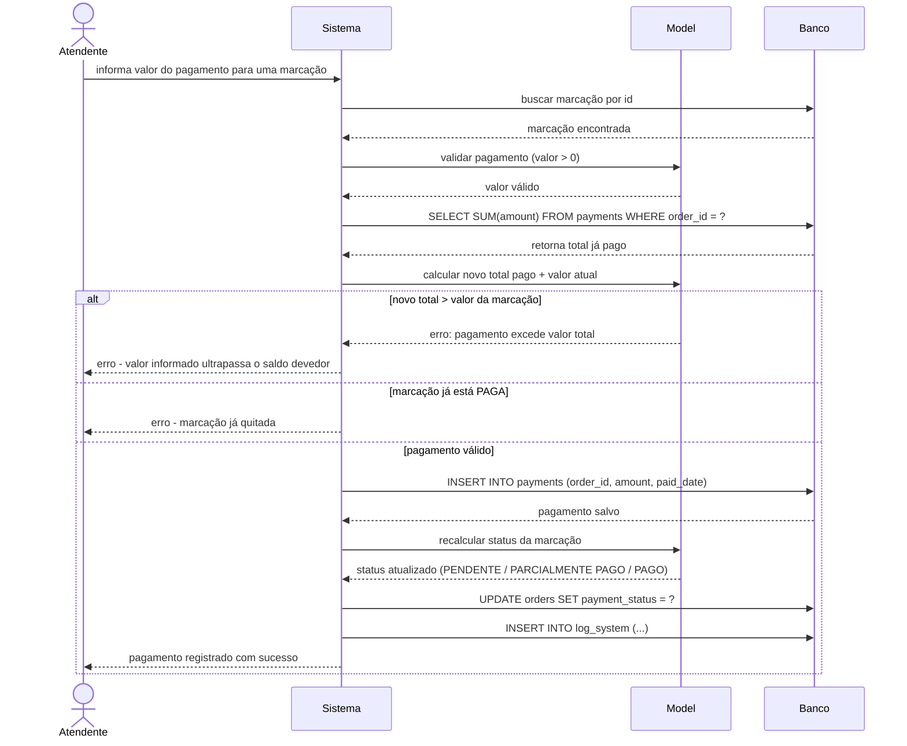

## 2. Registrar Pagamento (parcial ou total)

```mermaid
sequenceDiagram
    actor Atendente
    participant Sistema
    participant Model
    participant Banco

    Atendente->>Sistema: informa valor do pagamento para uma marcação
    Sistema->>Banco: buscar marcação por id
    Banco-->>Sistema: marcação encontrada
    Sistema->>Model: validar pagamento (valor > 0)
    Model-->>Sistema: valor válido
    Sistema->>Banco: SELECT SUM(amount) FROM payments WHERE order_id = ?
    Banco-->>Sistema: retorna total já pago
    Sistema->>Model: calcular novo total pago + valor atual
    
    alt novo total > valor da marcação
        Model-->>Sistema: erro: pagamento excede valor total
        Sistema-->>Atendente: erro - valor informado ultrapassa o saldo devedor
    else marcação já está PAGA
        Sistema-->>Atendente: erro - marcação já quitada
    else pagamento válido
        Sistema->>Banco: INSERT INTO payments (order_id, amount, paid_date)
        Banco-->>Sistema: pagamento salvo
        Sistema->>Model: recalcular status da marcação
        Model-->>Sistema: status atualizado (PENDENTE / PARCIALMENTE PAGO / PAGO)
        Sistema->>Banco: UPDATE orders SET payment_status = ?
        Sistema->>Banco: INSERT INTO log_system (...)
        Sistema-->>Atendente: pagamento registrado com sucesso
    end
```